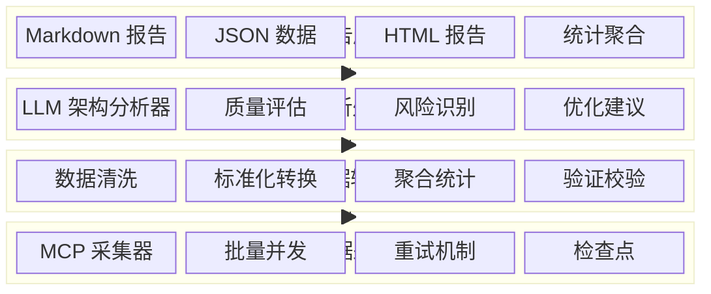
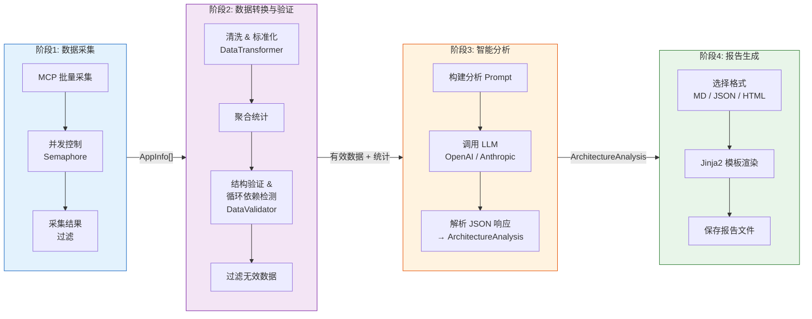
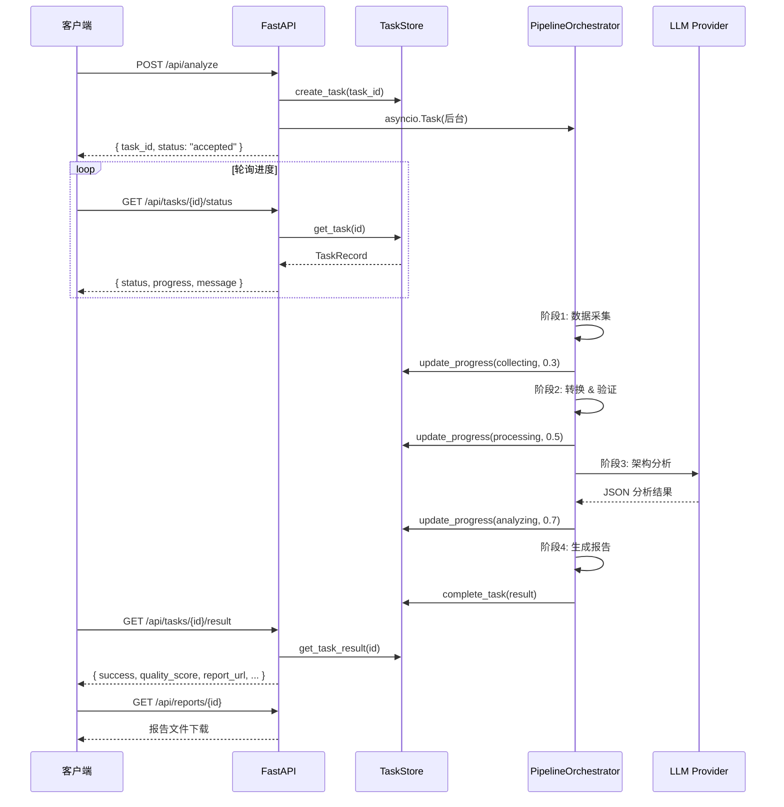
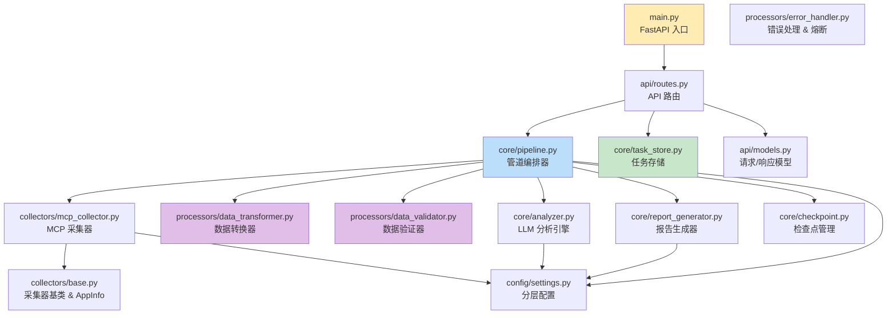

# AI Architecture Analyzer

[](https://www.python.org/downloads/)
[](https://fastapi.tiangolo.com/)
[](#-测试)
[](https://opensource.org/licenses/MIT)

基于 LLM 的企业级系统架构分析平台。通过 MCP 协议采集应用元数据，自动完成架构发现、依赖梳理、质量评估和结构化报告生成。

> 将原本需要人工数周的架构梳理工作，缩短至自动化数小时完成。

---

## 🏗️ 系统架构

### 分层架构总览



### 管道处理流程

核心分析流程由 `PipelineOrchestrator` 编排，分为 4 个阶段：



每个阶段执行后自动保存 **检查点**（`CheckpointManager`），支持故障恢复。

### API 任务生命周期



### 模块依赖关系



---

## 🚀 快速开始

### 环境要求

- Python 3.8+
- pip（推荐使用虚拟环境）

### 安装

```bash
# 克隆项目
git clone <repo-url>
cd ai-archi-analyzer

# 创建虚拟环境（推荐）
python -m venv .venv
source .venv/bin/activate

# 安装依赖
pip install -r requirements.txt

# 或者以开发模式安装
pip install -e ".[dev]"
```

### 配置

复制 `env.example` 为 `.env`，填入实际配置：

```bash
cp env.example .env
```

最小配置：

```bash
# LLM 配置（必需）
ARCHI_LLM__PROVIDER=openai
ARCHI_LLM__API_KEY=your_openai_api_key
ARCHI_LLM__MODEL=gpt-4

# MCP 配置（必需）
ARCHI_MCP__ENABLED=true
ARCHI_MCP__ENDPOINT=http://your-mcp-server:8080

# 调试模式
ARCHI_DEBUG=true
```

### 启动服务

```bash
# 方式1: 模块方式启动
python -m src.main

# 方式2: 启动脚本
python start.py
```

服务启动后访问：
- API 服务：`http://localhost:8000`
- Swagger 文档：`http://localhost:8000/docs`
- ReDoc 文档：`http://localhost:8000/redoc`

---

## 📖 API 使用指南

> 详细示例请参考：[使用示例](docs/examples.md)

### 完整分析流程

**Step 1 — 提交分析任务**

```bash
curl -X POST "http://localhost:8000/api/analyze" \
     -H "Content-Type: application/json" \
     -d '{
       "app_ids": ["user-service", "order-service", "payment-service"],
       "report_format": "markdown"
     }'
```

```json
{
  "task_id": "550e8400-e29b-41d4-a716-446655440000",
  "status": "accepted",
  "message": "架构分析任务已接受，正在处理中"
}
```

**Step 2 — 轮询任务进度**

```bash
curl "http://localhost:8000/api/tasks/{task_id}/status"
```

```json
{
  "task_id": "550e8400-e29b-41d4-a716-446655440000",
  "status": "analyzing",
  "progress": 0.6,
  "message": "执行架构智能分析",
  "created_at": "2024-01-15T10:30:00",
  "updated_at": "2024-01-15T10:32:15"
}
```

**Step 3 — 获取分析结果**

```bash
curl "http://localhost:8000/api/tasks/{task_id}/result"
```

```json
{
  "task_id": "550e8400-e29b-41d4-a716-446655440000",
  "success": true,
  "completed_at": "2024-01-15T10:35:23",
  "processing_time": 323.45,
  "report_url": "/api/reports/550e8400-e29b-41d4-a716-446655440000",
  "architecture_summary": {
    "type": "微服务架构",
    "summary": "该系统采用微服务架构，共包含15个服务..."
  },
  "total_apps": 15,
  "quality_score": 8.5
}
```

**Step 4 — 下载报告**

```bash
curl -O "http://localhost:8000/api/reports/{task_id}?format=markdown"
```

### 其他接口

| 方法 | 路径 | 说明 |
|------|------|------|
| `GET` | `/api/tasks` | 获取任务列表（`?active_only=true` 仅活跃任务） |
| `DELETE` | `/api/tasks/{task_id}` | 取消正在执行的任务 |
| `GET` | `/api/health` | 服务健康检查 |
| `GET` | `/api/config` | 获取配置信息（仅调试模式） |

---

## 🛠️ 开发指南

### 项目结构

```
ai-archi-analyzer/
├── src/
│   ├── api/                          # API 层
│   │   ├── routes.py                 # 路由定义（延迟初始化编排器）
│   │   └── models.py                 # Pydantic 请求/响应模型
│   ├── core/                         # 核心业务逻辑
│   │   ├── pipeline.py               # 管道编排器（4 阶段 + 进度回调）
│   │   ├── analyzer.py               # LLM 分析引擎（OpenAI / Anthropic）
│   │   ├── report_generator.py       # 报告生成器（MD / JSON / HTML）
│   │   ├── task_store.py             # 任务状态与结果存储
│   │   └── checkpoint.py             # 管道检查点持久化
│   ├── collectors/                   # 数据采集层
│   │   ├── base.py                   # AppInfo 模型 & 采集器基类
│   │   └── mcp_collector.py          # MCP 协议采集器（含重试）
│   ├── processors/                   # 数据处理层
│   │   ├── data_transformer.py       # 数据清洗 / 标准化 / 去重 / 聚合
│   │   ├── data_validator.py         # 结构验证 / 循环依赖检测
│   │   └── error_handler.py          # 熔断器 / 重试 / 资源限制
│   ├── config/
│   │   └── settings.py               # 分层配置管理（pydantic-settings）
│   └── main.py                       # FastAPI 应用入口
├── tests/                            # 测试套件（55 tests）
│   ├── conftest.py                   # 共享夹具 & 测试环境变量
│   ├── test_pipeline.py              # 管道编排器测试
│   ├── test_data_transformer.py      # 数据转换器测试
│   ├── test_data_validator.py        # 数据验证器测试
│   ├── test_task_store.py            # 任务存储测试
│   └── test_checkpoint.py            # 检查点管理器测试
├── docs/
│   └── examples.md                   # API 使用示例
├── env.example                       # 环境变量模板
├── pyproject.toml                    # 项目配置 & 工具设置
├── requirements.txt                  # 依赖清单
└── start.py                          # 便捷启动脚本
```

### 测试

```bash
# 运行所有测试
pytest

# 运行单个测试文件
pytest tests/test_data_transformer.py

# 运行特定测试
pytest tests/test_pipeline.py::TestPipelineOrchestrator::test_progress_callback

# 带覆盖率
pytest --cov=src --cov-report=html

# 详细输出
pytest -v
```

### 代码质量

```bash
# 格式化
black src/ tests/

# 导入排序
isort src/ tests/

# 类型检查
mypy src/
```

---

## 🔧 配置说明

所有配置项使用 `ARCHI_` 前缀，嵌套层级用 `__` 分隔，通过 `.env` 文件或环境变量设置。

### LLM 配置

| 配置项 | 说明 | 默认值 |
|--------|------|--------|
| `ARCHI_LLM__PROVIDER` | LLM 提供商（`openai` / `anthropic` / `azure` / `local`） | `openai` |
| `ARCHI_LLM__API_KEY` | API 密钥 | **必需** |
| `ARCHI_LLM__BASE_URL` | API 基础 URL | 各提供商默认 |
| `ARCHI_LLM__MODEL` | 模型名称 | `gpt-4` |
| `ARCHI_LLM__TEMPERATURE` | 温度参数 | `0.1` |
| `ARCHI_LLM__MAX_TOKENS` | 最大 token 数 | `4000` |
| `ARCHI_LLM__TIMEOUT` | 请求超时（秒） | `60` |

### MCP 配置

| 配置项 | 说明 | 默认值 |
|--------|------|--------|
| `ARCHI_MCP__ENABLED` | 是否启用 MCP | `false` |
| `ARCHI_MCP__ENDPOINT` | MCP 服务端点 | **必需** |
| `ARCHI_MCP__TIMEOUT` | 请求超时（秒） | `30` |
| `ARCHI_MCP__RETRY_ATTEMPTS` | 重试次数 | `3` |
| `ARCHI_MCP__RETRY_DELAY` | 重试延迟（秒） | `1.0` |

### 处理配置

| 配置项 | 说明 | 默认值 |
|--------|------|--------|
| `ARCHI_PROCESSING__MAX_CONCURRENT_APPS` | 最大并发采集数 | `10` |
| `ARCHI_PROCESSING__BATCH_SIZE` | 批处理大小 | `5` |
| `ARCHI_PROCESSING__OUTPUT_DIR` | 报告输出目录 | `./output` |
| `ARCHI_PROCESSING__CACHE_DIR` | 缓存/检查点目录 | `./cache` |

### API 配置

| 配置项 | 说明 | 默认值 |
|--------|------|--------|
| `ARCHI_API__HOST` | 服务主机 | `0.0.0.0` |
| `ARCHI_API__PORT` | 服务端口 | `8000` |
| `ARCHI_API__WORKERS` | 工作进程数 | `1` |
| `ARCHI_API__RELOAD` | 自动重载（开发用） | `false` |
| `ARCHI_API__CORS_ORIGINS` | CORS 允许源 | `*` |

---

## 🔌 扩展开发

### 添加新的数据采集器

```python
from src.collectors.base import BaseDataCollector, AppInfo, CollectorResult

class MyCollector(BaseDataCollector):
    async def collect_app_info(self, app_id: str) -> CollectorResult:
        # 实现采集逻辑
        app_info = AppInfo(app_id=app_id, name="...", language="...")
        return self._create_success_result(app_info)

    async def collect_batch_info(self, app_ids: list) -> list:
        return [await self.collect_app_info(aid) for aid in app_ids]

    async def health_check(self) -> bool:
        return True
```

### 添加新的 LLM 提供商

在 `src/core/analyzer.py` 的 `_create_llm_client()` 和 `_call_llm()` 中添加新的 provider 分支。

### 添加新的报告格式

1. 在 `ReportFormat` 中添加新常量
2. 在 `ReportGenerator` 中实现 `_generate_<format>_report()` 方法
3. 在 `save_report()` 的扩展名映射中添加对应项

---

## 🔮 技术栈

| 类别 | 技术 |
|------|------|
| Web 框架 | FastAPI + Uvicorn |
| 数据模型 | Pydantic v2 |
| HTTP 客户端 | httpx（异步） |
| LLM SDK | OpenAI / Anthropic |
| 模板引擎 | Jinja2 |
| 重试机制 | tenacity |
| 日志 | loguru |
| 测试 | pytest + pytest-asyncio |
| 格式化 | black + isort |
| 类型检查 | mypy（严格模式） |

---

## 🤝 贡献指南

1. Fork 本项目
2. 创建特性分支（`git checkout -b feature/AmazingFeature`）
3. 编写代码和测试
4. 确保所有测试通过（`pytest`）
5. 格式化代码（`black src/ tests/ && isort src/ tests/`）
6. 提交更改（`git commit -m 'feat: add AmazingFeature'`）
7. 推送到分支（`git push origin feature/AmazingFeature`）
8. 创建 Pull Request

## 📄 许可证

本项目采用 MIT 许可证 - 查看 [LICENSE](LICENSE) 文件了解详情。

---

**注意**: 本项目仍在积极开发中，API 可能会发生变化。当前 MCP 采集器使用模拟数据，真实 MCP 协议集成即将推出。
